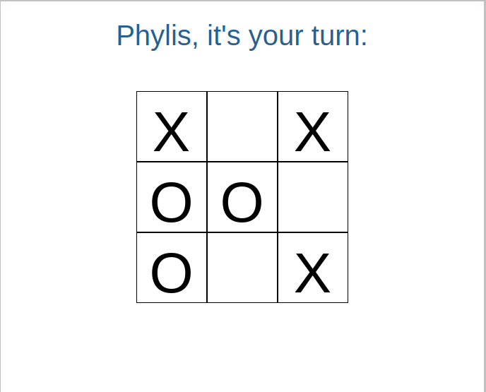

# Tic Tac Toe

This is a Tic Tac Toe game project from [The Odin Curriculum](https://www.theodinproject.com/courses/javascript/lessons/tic-tac-toe-javascript) based on factory functions.

## Web App Screenshots

## Built With

- Javascript
- Html
- CSS

## Live Demo

Click [here](https://rawcdn.githack.com/krys2fa/js-tic-tac-toe/1e9301d37abfb563829da4d35c3cfdb10a87cc29/index.html) to visit a live version of the web app.

## Getting Started

To get a local copy up and running follow these simple example steps.

### Prerequisites

- npm

### Setup
- Clone the repository.
- Run Live Server from VS Code

## Authors

👤 **Christopher Amanor**

- Github: [@krys2fa](https://github.com/krys2fa)
- Twitter: [@krys2fa](https://twitter.com/krys2fa)
- Linkedin: [Christopher Amanor](https://www.linkedin.com/in/christopher-amanor/)

👤 **Phylis Chepchumba**

- Github: [@Phlylis05](https://github.com/phlylis05)
- Linkedin: [PhylisChepchumba](https://linkedin.com/PhylisChepchumba)
- Twitter: [chepchumba05](https://twitter.com/chepchumba05)

## 🤝 Contributing

Contributions, issues and feature requests are welcome!

Feel free to check the [issues page](https://github.com/krys2fa/js-tic-tac-toe/issues).

## Show your support

Kindly give this repository a ⭐️ if you like this project!

## Acknowledgments

- Project specifications by [Microverse](https://www.microverse.org) and [The Odin Project](https://www.theodinproject.com/courses/javascript/lessons/tic-tac-toe-javascript).

## 📝 License

This project is licensed under the MIT License.
